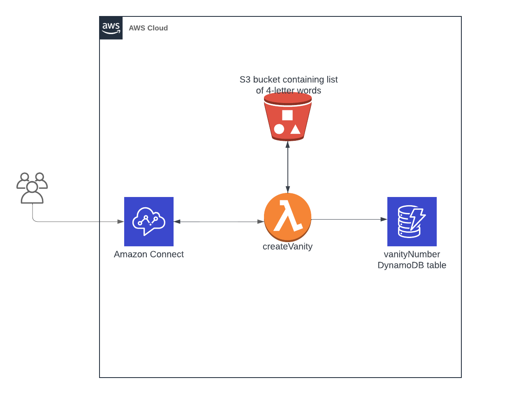

# Vanity Phone Numbers Application

## Overview
The Vanity Numbers Application is a serverless solution designed to convert standard telephone numbers into memorable "vanity" numbers. Vanity numbers are alphanumeric equivalents of a phone number that spell out words or phrases, making them easier to remember. This application automates the process of generating potential vanity numbers based on the last four digits of an incoming phone call's number.

## Features
- **Automatic Generation**: Automatically generates vanity numbers for the last four digits of incoming phone numbers.
- **AWS Integration**: Leverages AWS services such as Lambda, DynamoDB, and S3 to store and retrieve generated vanity numbers.
- **Customizable**: Offers customization options for the mapping of numbers to letters, allowing for different languages or preferences.
- **Scalable**: Built on AWS, the application can scale to handle large volumes of phone numbers efficiently.

## Architecture
This application uses AWS Lambda for the backend logic, DynamoDB for storing generated vanity numbers, and S3 for maintaining a repository of possible word combinations. The architecture is designed for high availability and scalability, ensuring that vanity numbers can be generated and retrieved quickly.



## Prerequisites
Before deploying and using the Vanity Numbers Application, ensure you have the following:
- An AWS account.
- The AWS CLI installed and configured.
- Node.js and npm installed.
- The AWS CDK Toolkit installed for deploying infrastructure as code.

## Deployment
1. Clone the repository to your local machine:

```bash
git clone https://github.com/codywiseman/vanity-numbers.git
```

2. Install the required dependencies:

```bash
cd vanity-number && npm install
```

3. Deploy the application using AWS CDK:

```bash
npm run deploy
```

### Importing the Amazon Connect Flow
1. Log in to your AWS Management Console and open the Amazon Connect service.
2. Select the instance where you want to import the flow.
3. In the navigation pane, choose 'Contact flows'.
4. In the 'Contact flows' section, choose 'Create contact flow'.
5. Import the provided contact flow file by clicking on the 'Import flow' button at the top right.
6. Upload the provided contact flow file provide in this repository then save the contact flow.

### Adding the Lambda Function to the Contact Flow
1. Add the Lambda to the Amazon Connect instance by navigating to the instance in the AWS Management Console
2. In the 'AWS Lambda' section, use the Function drop-down box to select the function to add to your instance.
3. Choose 'Add Lambda Function'. Confirm that the ARN of the function is added under Lambda Functions.
4. Open the imported contact flow in the Amazon Connect interface.
5. Find the 'Invoke AWS Lambda function' block in the contact flow editor.
6. Select the 'Vanity Number Generator' Lambda function from the dropdown list.
7. Connect the blocks as necessary to integrate the Lambda function into the flow.
8. Save and publish the contact flow.

## Unit Testing
1. Navigate to the root directory of the project in your terminal. Run the following:

```bash
npm run test
```

2. The tests are located in the `test` directory and can be modified as needed.

## Project Clean Up

To avoid incurring unnecessary charges, you should delete the AWS resources used by the project when they are no longer needed. If you used AWS CDK to deploy the resources, follow these steps:

1. Navigate to the root directory of the project in your terminal.

2. Run the following command to remove the resources defined in your CDK stack:

   ```bash
   cdk destroy
   ```

